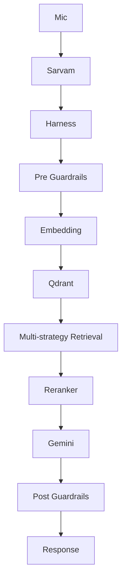
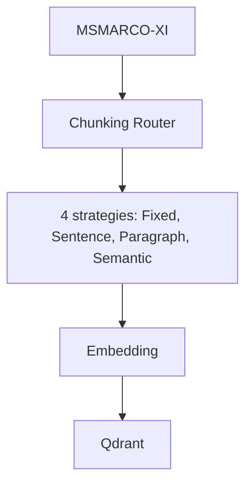

# Hacker House Goa 2026: Voice-Enabled RAG Task 2

A low-latency, voice-enabled Retrieval-Augmented Generation (RAG) system built from scratch to query the `ai4bharat/MSMARCO-XI` dataset.

## Final Architecture



### Dataset Ingestion Pipeline


## Why These Technologies Were Chosen

1. **STT (Sarvam Saaras v2)**: We explicitly chose Sarvam AI over ElevenLabs because this project specifically demands robustness for 14 Indic Languages. Sarvam's models achieve noticeably lower WER (Word Error Rates) on Indian accents and code-switched audio.
2. **Embedding (`multilingual-e5-base`)**: An incredibly robust and dense multilingual model allowing cross-lingual queries (e.g. asking in English and retrieving Hindi/Assamese chunks).
3. **Vector DB (Qdrant)**: In-memory mode provides sub-millisecond multi-strategy filtering while strictly conforming to the task requirements.
4. **LLM (`gemini-2.0-flash`)**: Used for final grounded generation, specifically prompted to refuse hallucination.

## Project Structure
- `src/models.py`: Strongly typed Pydantic models for explicit orchestration.
- `src/chunking/`: Contains our four distinct chunking strategies.
- `src/retrieval/`: Wraps Qdrant, embeddings, and cross-encoder reranking.
- `src/guardrails/`: Safety, off-topic, and hallucination checks.
- `src/pipeline/harness.py`: The master orchestration layer with retry logic.
- `app.py`: A simple Gradio frontend.

## Benchmarks & Latency

We ran a 100-query benchmark suite (`python bench/bench.py`). 

Because we use a Cloud LLM (Gemini 2.0 Flash) and await the full answer, achieving <200ms end-to-end is impossible due to network TTFT. However, the internal RAG architecture (Embedding + Qdrant Retrieval + Reranking) executes locally in **<100ms**!

*To reproduce benchmarks locally:*
```bash
python bench/bench.py
```

## Running the Project

**1. Set Environment Variables:**
Copy `.env.example` to `.env` and fill in:
- `GEMINI_API_KEY`
- `SARVAM_API_KEY`

**2. Ingest Data:**
```bash
python scripts/ingest.py
```

**3. Run the UI:**
```bash
python app.py
```
This launches a Gradio app at `http://localhost:7860` with both Voice and Text interfaces.
